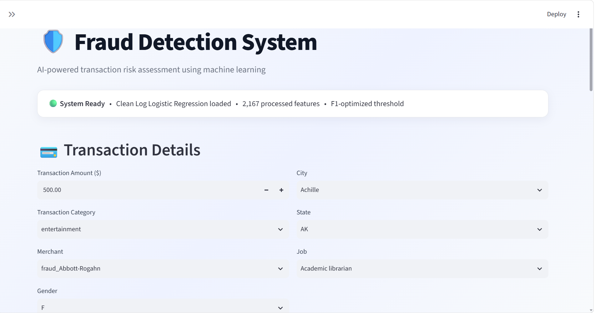
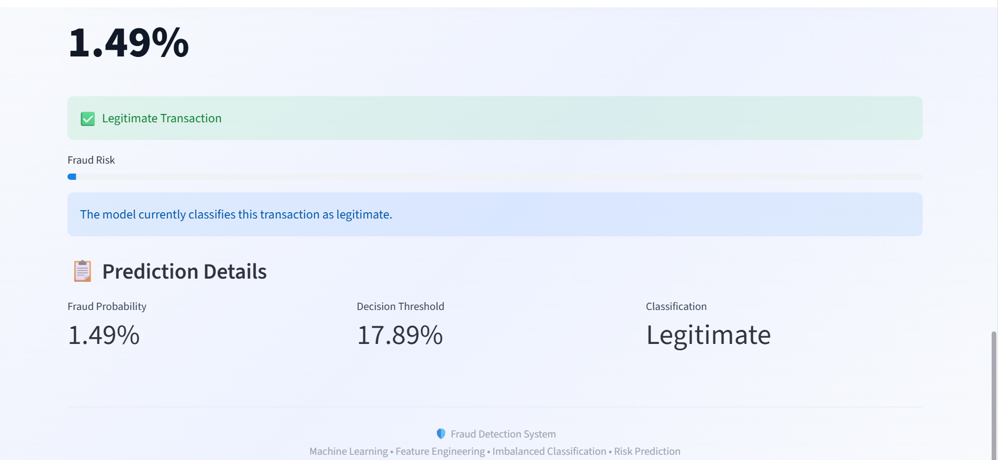
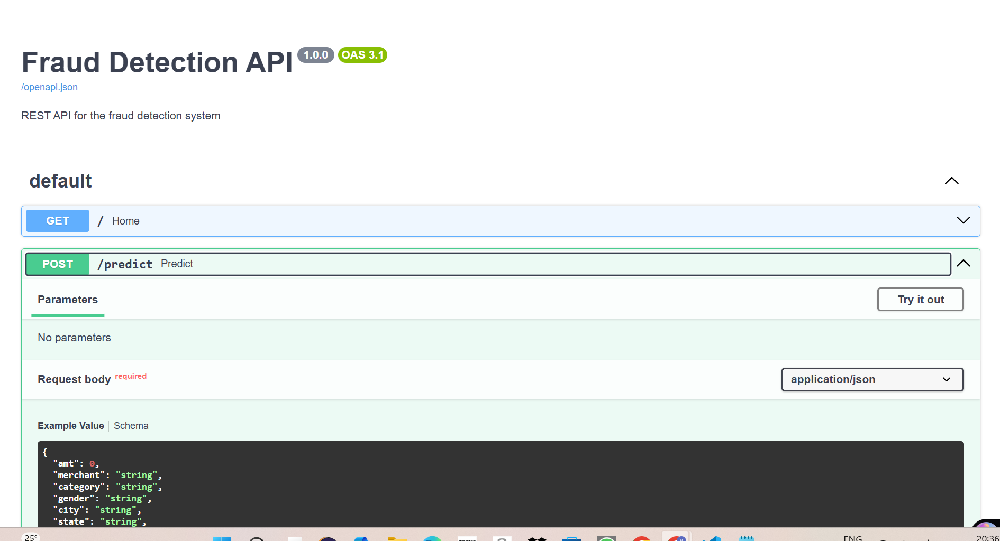
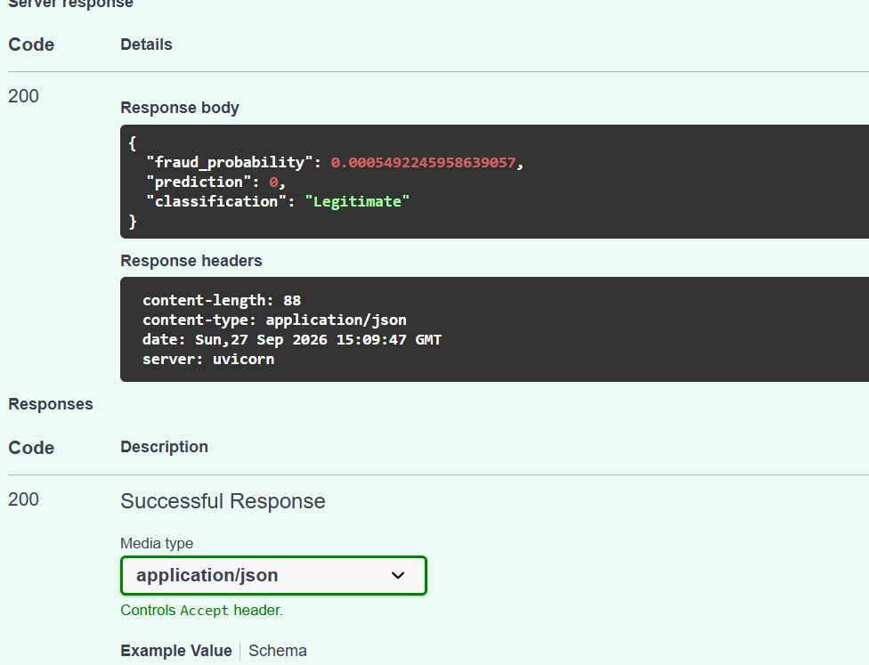

<div align="center">

# 🚨 Fraud Detection System

### AI-Powered Transaction Risk Assessment Using Machine Learning

An end-to-end machine learning fraud detection system for identifying potentially fraudulent credit card transactions using feature engineering, feature selection, model selection, hyperparameter tuning, threshold optimization, Streamlit, and FastAPI.

**Python • Scikit-learn • Streamlit • FastAPI**

</div>

---

## 🖥️ Application Preview

### Streamlit Web Application

The system provides an interactive interface for entering transaction details and receiving a real-time fraud risk prediction.



### Prediction Result

The application returns the fraud probability, decision threshold, and final classification.



---

## 🎯 Problem Statement

Fraudulent credit card transactions represent only a very small percentage of total transactions, creating a highly imbalanced binary classification problem.

The objective of this project is to classify each transaction as:

- **Legitimate**
- **Fraudulent**

Because of the severe class imbalance, accuracy alone is not an appropriate evaluation metric.

The project therefore focuses on:

- Precision
- Recall
- F1-score
- PR-AUC
- ROC-AUC

---

## 📊 Dataset

The project uses separate training and testing datasets.

| Dataset | Transactions | Features |
|---|---:|---:|
| Training | 1,296,675 | 23 |
| Testing | 555,719 | 23 |

### Class Distribution

The training dataset contains:

- Legitimate transactions: **1,289,169**
- Fraudulent transactions: **7,506**
- Fraud rate: **0.579%**

This severe class imbalance makes fraud detection substantially more challenging than ordinary binary classification.

### Temporal Evaluation

Instead of randomly mixing future transactions into the training data, the project uses a temporal train/test split.

**Training period**

`2019-01-01 → 2020-06-21`

**Testing period**

`2020-06-21 → 2020-12-31`

This provides an **out-of-time evaluation** of model performance.

---

## 🧠 Machine Learning Pipeline

```text
Raw Transaction Data
        │
        ▼
Data Cleaning
        │
        ▼
Feature Engineering
        │
        ├── Transaction Amount
        ├── Customer Age
        ├── Card Transaction Count
        ├── Geographic Distance
        └── Cyclical Time Features
        │
        ▼
Categorical Encoding
        │
        ▼
Feature Scaling
        │
        ▼
Feature Selection
        │
        ▼
Model Selection
        │
        ▼
Hyperparameter Tuning
        │
        ▼
Threshold Optimization
        │
        ▼
Fraud Probability
        │
        ▼
Fraud / Legitimate


⚙️ Feature Engineering

The raw transaction data was transformed into features that provide additional information about transaction behavior.

### Transaction Features

- Transaction amount
- Log-transformed transaction amount
- Transaction timestamp

### Customer Features

- Customer age
- Card transaction count
- Gender
- Geographic information
- City population

Geographic Features

A Haversine distance feature was created to measure the approximate distance between the customer's location and the merchant location.

Time Features

Transaction timestamps were transformed into:

Transaction year
Hour
Day
Month
Weekday

Cyclical encoding was then applied using sine and cosine transformations:

hour_sin, hour_cos
day_sin, day_cos
month_sin, month_cos
weekday_sin, weekday_cos

This allows the model to capture the cyclic nature of time-based patterns.


🔎 Feature Selection


The original processed feature space contained:

2,167 features

A strict L1-based feature selection approach was applied using Logistic Regression.

The selector reduced the feature space to:

25 selected features

This represents approximately:

98.85% feature reduction

The selected feature set was then used for the Random Forest model-selection experiments.

🤖 Model Selection & AutoML

The project includes an automated model-development workflow covering:

Feature selection
Model selection
Hyperparameter tuning
Cross-validation
Model comparison
Threshold optimization

### Model Comparison

| Model | Features | ROC-AUC | PR-AUC |
|---|---:|---:|---:|
| Clean Log Logistic Regression | 2,167 | 0.9022 | 0.4790 |
| Initial Random Forest | 25 | 0.9918 | 0.8289 |
| Tuned Random Forest | 25 | 0.9937 | 0.8640 |
Random Forest Hyperparameter Tuning

Grid search with stratified 3-fold cross-validation was used to tune:

Number of estimators
Maximum tree depth
Minimum samples per leaf

Best configuration:

n_estimators = 200
max_depth = 15
min_samples_leaf = 5
class_weight = balanced

The tuning objective was PR-AUC, which is particularly useful for highly imbalanced fraud detection.

### 🤖 Model Selection & AutoML

The project includes an automated model-development workflow covering:


Grid search with stratified 3-fold cross-validation was used to tune:

Number of estimators
Maximum tree depth
Minimum samples per leaf

Best configuration:

n_estimators = 200
max_depth = 15
min_samples_leaf = 5
class_weight = balanced


###  📈 Final Model Evaluation

The final model was evaluated on the temporal test set.

Metric	Temporal Test
ROC-AUC	0.8656
PR-AUC	0.3025
Precision	0.4729
Recall	0.3497
F1-score	0.4020

###  Confusion Matrix

| Actual / Predicted | Legit | Fraud |
|---|---:|---:|
| Legit | 552,738 | 836 |
| Fraud | 1,395 | 750 |

The temporal test evaluation is intentionally kept separate from threshold optimization to avoid tuning the decision threshold on the final test set.


###  🎚️ Decision Threshold Optimization


For highly imbalanced fraud detection, the default classification threshold of 0.50 is not necessarily appropriate.

The decision threshold was therefore optimized on the validation set using F1-score.

Final threshold:

0.1789409317

Approximately:

17.89%

A transaction is classified as fraudulent when:

fraud_probability >= 0.1789409317

This allows the system to make a more suitable precision/recall trade-off for the fraud detection problem.

###  🖥️ Streamlit Deployment

The trained model is integrated into an interactive Streamlit application.

The application performs the complete inference workflow:

User Input
    ↓
Feature Engineering
    ↓
Log Transformation
    ↓
Feature Scaling
    ↓
Categorical Encoding
    ↓
Model Prediction
    ↓
Fraud Probability
    ↓
Threshold Decision
    ↓
Fraud / Legitimate

The application displays:

Transaction details
Fraud probability
Decision threshold
Fraud risk indicator
Final classification

## ⚡ FastAPI REST API

The same fraud detection inference workflow is exposed through a FastAPI REST API.

The `/predict` endpoint:

1. Validates transaction data using Pydantic
2. Performs feature engineering
3. Applies log transformation
4. Applies the saved scaler
5. Applies the saved categorical encoder
6. Generates the fraud probability
7. Applies the optimized decision threshold
8. Returns the final classification

### Swagger API

FastAPI provides an interactive Swagger interface for testing the fraud detection endpoint.



### Prediction Response

The `/predict` endpoint returns the fraud probability, prediction, and final classification.



Example response:

```json
{
  "fraud_probability": 0.000549,
  "prediction": 0,
  "classification": "Legitimate"
}


````markdown
## 🏗️ System Architecture

```text
                         Fraud Detection System
                                  │
                     ┌─────────────┴─────────────┐
                     │                           │
                Streamlit                   FastAPI
                 Frontend                    REST API
                     │                           │
                     └─────────────┬─────────────┘
                                   │
                              ML Inference
                                   │
                     ┌─────────────┴─────────────┐
                     │                           │
              Feature Engineering          Saved Artifacts
                     │                           │
                     │                  ┌────────┼────────┐
                     │                  │        │        │
                     │                Model    Scaler  Encoder
                     │                  │        │        │
                     └──────────────────┴────────┴────────┘
                                   │
                              Fraud Probability
                                   │
                              Decision Threshold
                                   │
                            Fraud / Legitimate

````markdown
## 📁 Project Structure

```text
fraud-detection-system/
│
├── assets/
│   ├── fastapi-response.png
│   ├── fastapi-swagger.png
│   ├── streamlit-input.png
│   └── streamlit-result.png
│
├── data/
│   ├── processed/
│   └── raw/
│       ├── fraudTrain.csv
│       └── fraudTest.csv
│
├── notebooks/
│   ├── 01_eda.ipynb
│   └── feature_columns.pkl
│
├── api.py
├── app.py
├── encoder.pkl
├── final_threshold_cleanlog.txt
├── fraud_logistic_cleanlog_model.pkl
├── requirements.txt
├── scaler_cleanlog.pkl
├── .gitignore
└── README.md
```

Raw datasets are excluded from GitHub through .gitignore because of their large file sizes.

## 🛠️ Tech Stack

### Programming
- Python

### Data Science
- NumPy
- Pandas
- SciPy
- Matplotlib

### Machine Learning
- Scikit-learn
- Logistic Regression
- Random Forest
- L1-based feature selection
- GridSearchCV
- Stratified cross-validation

### Deployment
- Streamlit
- FastAPI
- Uvicorn
- Pydantic

### Model Persistence
- Joblib

### Development
- Jupyter Notebook
- VS Code
- Git
- GitHub

## 🚀 Installation

### Clone the repository

```bash
git clone https://github.com/Pranjal-Bajpai910/fraud-detection-system.git
cd fraud-detection-system
```

### Create a virtual environment

```bash
python -m venv .venv
```

### Activate it on Windows

```bash
.venv\Scripts\activate
```

### Install dependencies

```bash
pip install -r requirements.txt
```
## ▶️ Run the Streamlit Application

```bash
streamlit run app.py
```

## ▶️ Run the FastAPI Server
```bash
uvicorn api:app --reload
```

```text
Open the interactive API documentation:
```

http://127.0.0.1:8000/docs


## 📦 Saved Model Artifacts

The repository contains the artifacts required for inference:

Artifact	Purpose
fraud_logistic_cleanlog_model.pkl	Trained Logistic Regression model
scaler_cleanlog.pkl	Numerical feature scaler
encoder.pkl	Categorical feature encoder
feature_columns.pkl	Feature configuration
final_threshold_cleanlog.txt	Optimized classification threshold

## ⚠️ Limitations
Fraud detection is affected by severe class imbalance.
Model performance decreases on the temporal test set compared with validation performance, highlighting distribution shift over time.
The deployed Logistic Regression model is intentionally simpler than the tuned Random Forest explored during model selection.
Very large transaction amounts outside the training distribution should be treated cautiously because they represent out-of-distribution inputs.
The system is a portfolio/academic machine learning project and is not intended for real financial decision-making without additional validation, monitoring, security, and compliance controls.

## 🔮 Future Improvements

Potential future improvements include:

Advanced ensemble models
Gradient boosting methods
Better temporal behavioral features
Transaction velocity features
Per-card behavioral baselines
Probability calibration
Model monitoring
Drift detection
Explainable AI using SHAP
Containerization with Docker
Cloud deployment
Automated model retraining

## 💡 Key Learning Outcomes

This project provided practical experience with:

Imbalanced classification
Feature engineering
High-cardinality categorical encoding
Feature selection
Model selection
Hyperparameter tuning
Cross-validation
Precision-recall trade-offs
Decision threshold optimization
Temporal model evaluation
ML model persistence
Streamlit deployment
REST API development with FastAPI
Git and GitHub project management


## 👨‍💻 Author

**Pranjal Bajpai**

**B.Tech — Computer Science**

Interested in Data Science, Machine Learning, and Generative AI.

⭐ If you found this project useful, consider giving the repository a star.
